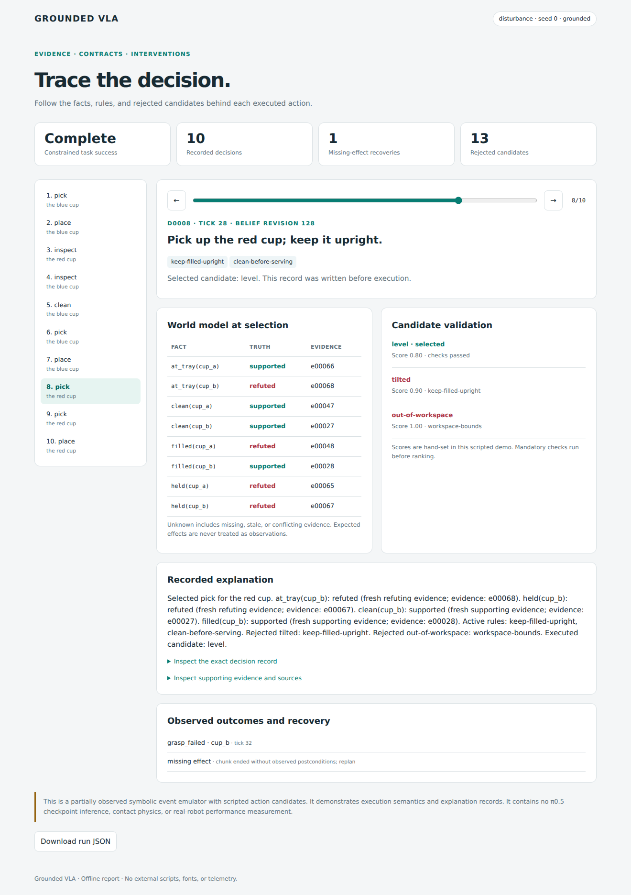

# Grounded VLA

**Evidence-grounded contracts and intervenable execution for vision-language-action policies.**

Grounded VLA explores how explicit knowledge can shape a robot's next subtask, validate proposed actions, and explain why a decision changed. It connects a runnable execution prototype with integration points for **KnowRob** and **π0.5 through openpi**, plus a **graph adapter trained inside the real openpi π0 model**.

The core demo runs on a laptop with Python alone. It produces a self-contained trace explorer showing the world model, active rules, rejected candidates, observed effects, and recovery decisions.



## Train the adapter with real π0

**v0.2.0:** the graph adapter now conditions native π0 action tokens during both flow-matching training and inference. The pretrained base stays frozen. The pipeline includes causal episode preparation, train-only normalization, checkpoint/resume, paired graph ablation, real denoising, websocket serving and a training container.

Start with [the complete π0 training guide](docs/pi0-training.md), [the dataset contract](docs/training-data.md), [the training config](configs/pi0_adapter.json), and [Dockerfile.train](Dockerfile.train).

```bash
docker build -f Dockerfile.train -t grounded-vla:pi0 .
# After preparing the real checkpoint, tokenizer and recorded episodes:
grounded-vla-prepare data/manifest.json --out data/prepared.json
grounded-vla-train configs/pi0_adapter.json
grounded-vla-predict runs/pi0-adapter/step-00010000 runs/observation.npz --out runs/actions.npz
```

The CLI commands above require the local training environment; the guide provides the equivalent Docker commands and all mounts. Real weights and demonstrations are supplied by you. Native algorithms are tested on a reduced, untrained π0 model; full pretrained GPU training and the Docker build have not been run in this environment. No robot performance gain is claimed.

## Run the showcase

Requires **Python 3.11 or newer**. Run these commands inside the extracted repository:

```bash
python -m venv .venv
source .venv/bin/activate
python -m pip install -e .
grounded-vla demo
```

On Windows, activate with `.venv\Scripts\Activate.ps1` in PowerShell instead of `source`.

Open **`runs/demo/report.html`** in a browser. It works offline and needs no web server. An already generated example is included at [docs/demo.html](docs/demo.html); download it to open locally, since GitHub displays HTML source.

The same entry point is available as `python -m grounded_vla demo`.

```bash
grounded-vla demo --scenario stale --out runs/stale
grounded-vla intervene
grounded-vla evaluate --seeds 10
grounded-vla explain runs/demo/trace.jsonl
```

## What the demo does

The task is to put two cups on a serving tray, requiring evidence of cleanliness and keeping filled cups upright. One cup initially has unknown properties. During the default scenario, an observed dirty contact invalidates the other cup's earlier cleanliness evidence. A grasp also fails once.

The executive obtains missing information, revises the world model, filters incompatible action candidates, and retries only after checking what actually happened. A planned `held(cup)` effect never becomes a fact just because a grasp was requested.

The environment is a **partially observed symbolic event emulator**. Each scripted chunk has four toy pose samples; terminal skill effects are implemented as state transitions. There are no camera pixels, contact dynamics, or learned action predictions in this demo. Candidate scores deliberately favor an invalid workspace path and a tilted path, making the filtering mechanism visible.

## Implemented scope

| Component | Included and runnable | Validation scope |
| --- | --- | --- |
| Evidence ledger | Supported/refuted/unknown queries, expiry, conflict preservation, provenance, retraction | Automated behavior tests |
| Task execution | Inspect/clean/pick/place contracts, short grounded instructions, prefix validation, effect monitoring, recovery | Six deterministic scenario families |
| Explanations | Immutable decision snapshots, evidence IDs, rejected alternatives, readable rationale, JSONL trace | Ordering, provenance, mutation and hash checks |
| Interventions | Evidence removal, relevant changes, irrelevant changes, rule changes, fill-state changes | Five matched controller-level intervention checks |
| KnowRob adapter | Native Python bindings in a bounded worker; snapshot synchronization; queries used by the executive | Source-verified API and transport-double tests; native runtime not exercised in the packaged validation |
| openpi adapter | Bounded websocket transport, LIBERO/DROID inputs, graph forwarding, action checks | Native reduced-model websocket roundtrip and input/output tests |
| π0 training | Graph-conditioned native action tokens, frozen base, flow matching, causal data, resume and inference | Native reduced-model backprop, denoising, exact CPU resume and artifact roundtrip |

This release is a research prototype. It does not claim an end-to-end deployment of KnowRob + π0.5, improved LIBERO results, a trained π0.5 graph adapter, NEEM format compatibility, or formal physical safety. The native integrations have explicit boundaries in [the integration guide](docs/integrations.md).

## Architecture

```mermaid
flowchart TD
    O["Observation adapter"] --> B["Evidence ledger"]
    B --> K["KnowRob mirror, optional"]
    B --> E["Contract executive"]
    K --> E
    E --> P["Action policy"]
    P --> V["Validation and ranking"]
    E --> V
    V --> R["Environment or robot adapter"]
    R --> O
    E --> J["Decision journal"]
    V --> J
    O --> J
```



The main control path lives in [`runner.py`](src/grounded_vla/runner.py). The bundled runner selects the scripted event environment. The openpi adapter exposes action proposals for a separate robot integration; it is intentionally not sent through the toy pose validator.

The reasoning boundary is concrete: a fact can satisfy a precondition only if it has usable evidence at the current query time. The graph adapter supplies a learned conditioning path inside π0; it does not make the rule engine differentiable.

## Explore the mechanisms

| Scenario | Change introduced |
| --- | --- |
| `clean` | Both cups have established properties |
| `unknown` | The second cup requires inspection |
| `stale` | Initial evidence expires during a queued action |
| `conflict` | Two sources disagree until inspection resolves the conflict |
| `grasp_failure` | One grasp ends without the expected observed effect |
| `disturbance` | Dirty contact invalidates prior knowledge, plus a failed grasp |

Compare the full controller with an ablation:

```bash
grounded-vla demo --scenario disturbance --method no_retraction --out runs/no-retraction
grounded-vla demo --scenario clean --method no_semantic_guard --out runs/no-guard
```

All variants receive the same sensor reports and use the same candidate generator. `no_retraction` ignores the dirty-contact invalidation event. `no_semantic_guard` removes the orientation filter while retaining workspace and precondition checks. These are mechanism ablations, not strong VLA baselines.

`evaluate` pairs scene seeds across the three variants and writes `episodes.csv` plus `results.json`. Every started episode counts, including timeouts and incomplete tasks. The outputs are synthetic diagnostic results and should not be presented as π0.5 performance evidence. See [evaluation scope](docs/evaluation.md).

## Run the small synthetic adapter example

```bash
python -m pip install -e ".[learning]"
python examples/train_adapter.py --steps 150 --out runs/adapter
```

The example trains on a known synthetic regression target with separate training and held-out samples. It saves a `state_dict` checkpoint and loss history. It demonstrates that optimization works; it uses no robot demonstrations or π0.5 weights.

```python
from grounded_vla.learning.adapter import GatedKnowledgeAdapter

adapter = GatedKnowledgeAdapter(feature_dim=32, hidden_dim=256, heads=8, context_tokens=8)
# hidden: [B,T,256]; features: [B,N,32]
# edge_types: int64 [B,N,N]; valid: bool [B,N]
conditioned_hidden = adapter(hidden, features, edge_types, valid)
```

Object features must be grounded in visual regions or another explicit entity binding. The encoder has no arbitrary object-ID embeddings. Consistent node/edge permutation leaves its pooled context unchanged. Fully invalid or empty graphs produce an exact identity update, including after biases have been trained.

For actual π0 training, use [the native training pipeline](docs/pi0-training.md). π0.5 adapter training remains a separate extension. Details: [learning interface](docs/learning.md).

## Connect the external runtimes

KnowRob can replace the reference query path while the event emulator remains the environment:

```bash
grounded-vla demo --knowrob-config knowledge/knowrob.json --out runs/native-knowrob
```

This requires a built KnowRob Python module in the active interpreter. It does not install KnowRob automatically. The parent process bounds startup and queries; an unavailable backend raises an error rather than inventing a truth value.

The openpi example requests proposals from a running policy server using a captured observation:

```bash
python examples/openpi_probe.py captured_observation.npz \
  --embodiment libero --action-dim 7 --uri ws://localhost:8000
```

The capture file must contain the documented RGB images and state arrays. No fabricated observation is substituted. This command saves actions and does not execute a robot. Setup, source revisions, API assumptions, and integration gaps are documented in [docs/integrations.md](docs/integrations.md).

## Development

```bash
python -m pip install -e ".[dev,openpi]"
python -m pytest -q
python -m ruff check .
python -m ruff format --check .
```

Install the `learning` extra to run the PyTorch tests; they are explicitly skipped otherwise. CI runs the core tests on Python 3.11/3.12 and the learning tests in a separate CPU job. A checked-in workflow is provided; it has not been run on your GitHub repository yet.

The packaged local validation passed **70 tests** and **5/5 intervention checks**, ran 180 synthetic evaluation episodes, and exercised the offline report on desktop and mobile viewports. See [validation details](docs/validation.md) for versions and remaining integration limits.

| Location | Purpose |
| --- | --- |
| `src/grounded_vla/belief.py` | Evidence semantics and revision history |
| `src/grounded_vla/contracts.py` | Task rules, contract construction, instruction compilation |
| `src/grounded_vla/runner.py` | Execution and observed-effect monitoring |
| `src/grounded_vla/backends/` | Native KnowRob and openpi integration boundaries |
| `src/grounded_vla/learning/` | Trainable graph attention and masked losses |
| `tests/` | Behavioral, causal, transport-contract, and gradient checks |
| `examples/` | Synthetic adapter training and external inference probe |
| `knowledge/` | KnowRob configuration and project RDF vocabulary |
| `docs/` | Architecture, integration, evaluation, and proposal |

## Research direction

The next experiment is a matched-perception, matched-information comparison using a real VLA executor and a physics-based environment. The key question is whether explicit freshness, retraction, and task contracts improve long-horizon performance relative to strong hierarchical and memory baselines. Causal intervention tests should verify that explanations refer to facts and rules actually used in decisions.

The full [research proposal](docs/research-proposal.md) motivates the intended study. It is broader than the implemented v0.1.0 scope.

Relevant foundations include [KnowRob](https://github.com/knowrob/knowrob), [π0.5](https://arxiv.org/abs/2504.16054), and [openpi remote inference](https://github.com/Physical-Intelligence/openpi/blob/main/docs/remote_inference.md). Concrete implementation references are recorded with revisions in [the integration guide](docs/integrations.md).

## License and citation

Original code is available under the [MIT License](LICENSE). External runtimes, model weights, and datasets retain their own terms and are not bundled. See [NOTICE](NOTICE) and [CITATION.cff](CITATION.cff).
