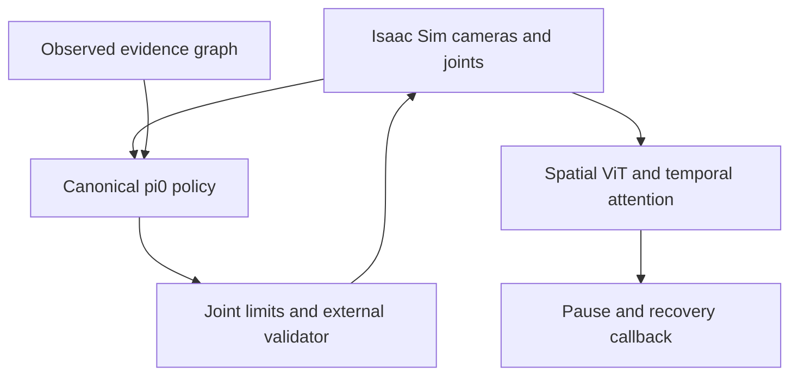

# Isaac Sim and temporal ViT integration

Base: GitHub `pi0-integration`, commit
`13f6d9129c05da8730700554f27eaf1377f51e39` (not `main`).

The physics runner executes **absolute joint-position targets** in synchronous
Isaac Sim. A spatial ViT and temporal attention head monitor RGB windows. A
stall/failure event pauses physics, discards the remaining action chunk, and
then invokes an optional recovery callback. The original `grounded-vla demo`
remains a separate symbolic event emulator.



Navigation remains a separate Semantic Navigation Planner / Nav2 responsibility.
The bridge does not implement TIAGo inverse kinematics or a perception system
for binding observed objects to graph nodes.

## Environment and API baseline

For a container workflow, use [Docker setup](docker.md). It builds the updated
training image and a separate `Dockerfile.isaacsim` image, with CPU dependency
checks during build and explicit GPU/runtime checks afterward.

- Python 3.11+ for the package; use the interpreter bundled with your Isaac Sim.
- Native API reviewed against NVIDIA Isaac Sim 5.1 source and 6.0.1 docs:
  `SimulationApp`, `World`, `SingleArticulation`, `ArticulationAction`, `Camera`.
- The `isaacsim.sensors.camera` module is a deprecated compatibility API in
  Isaac Sim 6.0.1. This bridge uses it deliberately; future removal needs a port.
- CPU vision validation: PyTorch **2.7.1**, torchvision **0.22.1**.
- Run the π0 server in the existing pinned openpi training environment, separately
  from Isaac Sim. See [pi0-training.md](pi0-training.md).

Create `SimulationApp` before importing Isaac Sim extensions. The CLI enforces
this ordering and loads the optional torch critic afterward. Recording itself
does not import PyTorch. No simulator, assets, driver, or model weights are
installed by the simulation extra.

```bash
ISAAC_PYTHON=/absolute/path/to/isaac-sim/python.sh
"$ISAAC_PYTHON" -m pip install -e '.[simulation]'
"$ISAAC_PYTHON" -m pip install /absolute/path/to/openpi/packages/openpi-client
# For online critic inference, use torch/torchvision compatible with this Isaac
# installation. Check its bundled versions before allowing pip to replace them.
"$ISAAC_PYTHON" -m pip install -e '.[vision]'
```

Use the client from the same pinned openpi checkout as the server. It provides
the MessagePack codec and websocket dependency used by `OpenPiTransport`.

## Configure the scene and action contract

Edit [isaacsim.example.json](../configs/isaacsim.example.json):

| Field | Required meaning |
| --- | --- |
| `stage_path` | Existing USD scene; local relative paths resolve from the config |
| `robot_prim_path` | Articulation root already present in the scene |
| `camera_paths` | Existing camera prims, named `base_0_rgb` / `left_wrist_0_rgb` / `right_wrist_0_rgb` |
| `joint_names` | Exact model state/action order, resolved by name against the USD DOFs |
| Limits and `max_joint_step` | Per-joint physical units: radians or metres |
| `physics_dt × steps_per_action` | Exactly the training control period |

The template illustrates a nine-DOF Franka mapping and placeholder scene/camera
paths. Check limits against your asset. For TIAGo, supply its own USD, camera
paths, joint order, limits, and demonstrations. No TIAGo asset is bundled.
Author lighting, colliders, drives, camera placement, and valid initial joint
states in the scene before running. At least one camera is required; the bridge
requests 224×224 frames and preserves RGB order.

`IsaacSimConfig.action_convention` generates the exact wire contract, including
joint order, for example:

```text
absolute_joint_positions[panda_joint1,panda_joint2,panda_joint3,panda_joint4,panda_joint5,panda_joint6,panda_joint7,panda_finger_joint1,panda_finger_joint2]
```

Use this string in the π0 dataset manifest, with `input_preset="canonical"`,
`state_dim=9`, `action_dim=9`, and `control_period_seconds=0.05` for this template.
Every finger has an explicit position. There is no implicit gripper or
end-effector conversion. A LIBERO/DROID policy is rejected; changing metadata
alone cannot convert the policy's learned semantics.

First run a camera/articulation check without policy weights:

```bash
"$ISAAC_PYTHON" -m grounded_vla.isaacsim_cli configs/isaacsim.example.json \
  --capture-only --out runs/camera-check
```

This writes `observation.npz` and `summary.json`. Warm-up is bounded. Missing,
stale, repeated, or future camera frames cause an error, never a fabricated
image. The capture-only output is not a training episode.

## Graph provider and closed-loop execution

Start the trained canonical policy in its training environment:

```bash
grounded-vla-serve runs/pi0-adapter/step-00010000 --host 127.0.0.1 --port 8000
```

The server now advertises state dimension and graph dimensions along with its
existing schema, action convention, horizon, and period. The bridge checks
these before submitting a policy action.

A graph-provider callback receives `SimObservation` and returns
`GraphSnapshot(graph, timestamp)`. The graph contains `schema_id`, float32
`features[N,F]`, int64 `edges[N,N]`, and boolean `valid[N]` matching training.
The timestamp uses the **simulation clock**. Future graphs and snapshots older
than 0.5 seconds are rejected by default; programmatic callers can configure
`CanonicalSimPolicy(max_graph_age_seconds=...)`.

For the existing belief schema, call `training.graph.encode_belief_graph` with
your current ledger, observed object bindings, and directed relations. Positions
must use the training coordinate frame. Preserve the actual source timestamp;
do not make stale evidence appear fresh by assigning it the current time. No
identity, cleanliness, grasp-success, or other fact is invented by the bridge.

```bash
"$ISAAC_PYTHON" -m grounded_vla.isaacsim_cli configs/isaacsim.example.json \
  --uri ws://localhost:8000 --prompt 'pick the part and place it in the tray' \
  --graph-provider my_application.context:current_graph \
  --critic-checkpoint runs/critic/critic.pt \
  --max-steps 100 --execute-steps 1 --out runs/isaacsim-001
```

`my_application.context:current_graph` is your application callback, not a
bundled module. For a connection-only baseline, replace the graph/critic options
with `--empty-graph --no-critic`. Both ablations are explicit and recorded.

Immediately before each action, the bridge checks joint limits and maximum
displacement from **measured position**. Programmatic callers can supply an
independent `action_guard(state, target)` to `IsaacSimEnvironment.from_config`;
raise to reject a target. Use this hook for collision, workspace, and task
validators. Joint bounds alone do not establish collision freedom or safety.
The same callback is available from the CLI as `--action-guard module:function`.

One action followed by replanning is the default. Longer prefixes still get
per-action measurements/checks and critic updates, but their policy conditioning
comes from the original inference. Prefer one-step replanning when evidence
changes must immediately influence the next command.

Connection and inference timeouts are bounded by `OpenPiTransport`. Synchronous
physics does not advance during inference; this is not a real-time hardware
controller. Errors, interrupts, critic events, and budget exhaustion pause the
simulator. Exhausting the budget is never reported as task success.

## Recordings and critic training

After each successfully completed control step, the recorder stores its
**pre-action** RGB/state, submitted action, prompt, graph, and graph timestamp.
`episode.npz` uses the existing π0 recording format. `summary.json` identifies
the source as a policy rollout, not an expert demonstration. Review outcomes
before using such trajectories for imitation learning.

For critic training, add integer `critic_labels[T]` to the recorded NPZ:

| Value | Class | Annotation |
| --- | --- | --- |
| 0 | progressing | Expected task progress is visible |
| 1 | stalled | Progress has stopped under your annotation rule |
| 2 | failed | An observed skill/task failure |
| 3 | completed | Completion is visible under your annotation rule |

Use human-reviewed or independently validated labels, not the critic's own
predictions. Split by episode and group related scenes/tasks to avoid leakage.
The loader rejects duplicate paths/bytes across splits and validates frame
timing and camera availability. It requires separate train/validation episodes
and all four classes among training windows.

Edit [critic-manifest.example.json](../configs/critic-manifest.example.json):

```bash
python -m pip install -e '.[vision]'
grounded-vla-train-critic configs/critic-manifest.example.json \
  --out runs/critic/critic.pt --device cuda --epochs 5 --window-size 8
```

By default the command downloads torchvision's ImageNet ViT-B/16 initialization
once, freezes that backbone, and trains projection, positional embeddings,
causal temporal attention, and the four-class head with cross-entropy. Every
window ends at its label; future frames are excluded. `--random-init` is a
development option. An optional test split stays out of training/validation.
The CLI reports train/validation loss and accuracy; it does not calibrate alert
thresholds or report a test score.

The checkpoint includes all backbone/head weights and training provenance.
Restoration uses `weights_only=True`, validates format/class order/preprocessing
and trained status, and checks the configured camera and frame period. Loading
does not download weights. A complete checkpoint is roughly the size of the
ViT-B/16 backbone; weights are not part of this source release.

## Monitor and recovery hook

Default monitoring waits for eight frames, then evaluates overlapping windows.
Two consecutive windows with `P(stalled)+P(failed) >= 0.8` produce one latched
pause event. Threshold, patience, camera, and inference device are configurable.
At 20 Hz the window spans 0.35 seconds, before additional detection/inference
latency. This is not an emergency-stop mechanism.

`completed` predictions do not assert success in the evidence ledger; completion
still requires independently observed effects. Calibrate false alarms and
missed failures on held-out data. A trained flag records that training occurred,
not that the critic is accurate.

`--on-event my_application.recovery:review` invokes `(event, observation)`
**after pausing**. It can request an event-triggered VLM assessment. The return
value is never executed. Validate a recovery proposal before starting a new
rollout. `run_rollout` resets monitor history at episode start.

## Validation scope

Local validation on Python 3.12.14: **126 passed**, with the native openpi test
module skipped because openpi is not installed. This includes **40 new tests**
for the simulator bridge and temporal critic. Ruff lint and format checks pass.

```bash
python -m pip install -e '.[dev,vision]'
python -m pytest -q tests/test_isaacsim.py tests/test_temporal_vit.py
python -m ruff check .
python -m ruff format --check .
```

Simulator/transport doubles test camera freshness, DOF mapping, rejection before
submission, metadata/graph mismatch, causal recordings, timeout handling, and
pausing before callbacks. Critic tests exercise actual torchvision ViT blocks
at reduced dimensions for backprop/checkpoint restoration, plus a full
untrained ViT-B/16 forward pass. They check padding isolation, temporal order,
frozen weights, warm-up/patience/latching, and episode-disjoint windows.

**Not run here:** Isaac Sim/RTX rendering and physics, pretrained π0-to-Isaac
rollouts, task-labelled critic training, TIAGo control, or a VLM service. Before
claiming experimental results, run the capture check and a bounded rollout on
your GPU host with the exact USD, checkpoints, graph provider, and validators.
Inspect raw recordings and observed outcomes. API review is not a native run.

## Upstream references

- [NVIDIA 6.0.1 articulation controller](https://docs.isaacsim.omniverse.nvidia.com/6.0.1/robot_simulation/articulation_controller.html)
- [NVIDIA 6.0.1 Camera compatibility API](https://docs.isaacsim.omniverse.nvidia.com/6.0.1/py/source/deprecated/isaacsim.sensors.camera/docs/index.html)
- [NVIDIA 5.1 Camera source](https://github.com/isaac-sim/IsaacSim/blob/v5.1.0/source/extensions/isaacsim.sensors.camera/isaacsim/sensors/camera/camera.py)
- [torchvision ViT-B/16](https://docs.pytorch.org/vision/stable/models/generated/torchvision.models.vit_b_16.html)
