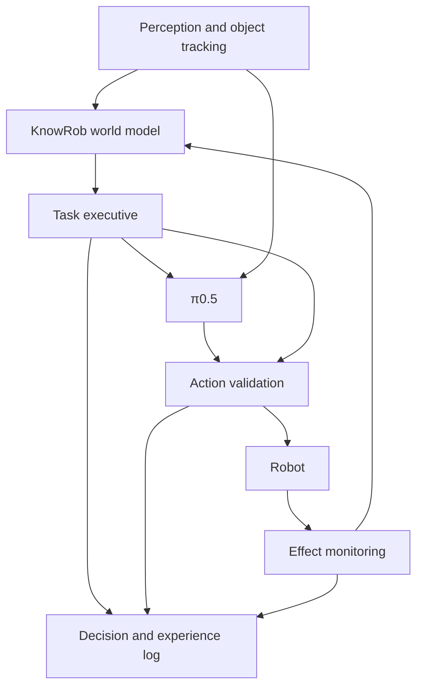

# Intervenable Neurosymbolic Robot Control with KnowRob and π0.5

The central thesis of this project is that improving a strong visuomotor policy does not necessarily require relearning all of its physical skills. Explicitly representing which object the robot acts on, for what purpose, under which preconditions, what it knows, what it merely assumes, and which beliefs it revises after failure could provide a meaningful advantage, particularly on long tasks. The proposed system uses π0.5 to generate motion while making KnowRob an active execution component for task state, feasibility, experience, and decision rationales.

The proposal has three goals: improve task success and recovery; reduce the number of demonstrations or attempts needed to reach a given level of success; and explain consequential decisions through observations, rules, and interventions. None of these is presented as an existing experimental result. The architecture, hypotheses, thresholds, data quantities, and schedule below constitute a research design. Findings from the literature are identified separately through numbered references.

The initial application domain is tabletop and kitchen manipulation. The initial robot assumption is a single arm with a parallel gripper, at least one external camera, and a wrist camera. A mobile base, bimanual manipulation, deformable objects, and force-sensitive assembly are extensions to pursue after demonstrating the core contribution. This scope is chosen to distinguish failures of motor skill from missing knowledge and incorrect subtask selection.

**Core recommendation:** First build a KnowRob execution layer that requires no additional policy training. Demonstrate its benefit against a strong hierarchical π0.5 baseline. Then use a small learnable interface to convey the relations shown to be necessary to the action expert. Generate explanations from the same records that produce execution decisions. Dumping the entire ontology into a prompt or retraining the full model should not be the first research step.

## 1. Research problem and expected contribution

π0.5 should not be treated as a simple network that maps one image to one motor command. The original work combines high-level textual subtask inference with continuous action chunk generation conditioned on the subtask, and co-trains on heterogeneous robot, web, and semantic supervision data. The proposal therefore cannot start from the claim that the model has no task knowledge. The research question is how much that knowledge can be complemented by persistent, queryable, revisable task state that can be intervened on externally.[^1]

For example, a robot may have observed a blue cup being cleaned earlier. The cup is now behind another object, and the current image does not reveal its cleaning history. If someone subsequently returns it to a dirty area, the earlier knowledge may also become invalid. This requires more than recognizing an object category: object identity, time, event order, evidence provenance, and freshness must be managed together.

A defensible original contribution is **an execution interface in which knowledge affects decisions and that effect can be tested through interventions**. It is insufficient for a rule to appear in an explanation. When that rule or a supporting fact is changed under controlled conditions, the relevant decision should change in the expected direction. When an irrelevant fact changes, behavior should remain as stable as possible. Explainability would therefore rest on more than readable text generation.

The study should be organized around three outputs. The first is a reference architecture that connects uncertain, changing knowledge to π0.5 execution. The second is a controlled benchmark extension measuring robustness to incorrect or incomplete knowledge and explanation faithfulness. The third is an experimental comparison of online knowledge use and offline policy learning that identifies when each form of integration helps.

## 2. Boundaries established by the literature

KnowRob's historical contribution goes beyond storing triples. The KnowRob 2.0 line of work aims to combine symbolic queries with simulation, geometric computation, and experience. The NEEM approach links the narrative content of experience to temporally indexed sensory records. SOMA provides a suitable conceptual foundation for modeling both the physical properties of objects and the roles they play in a particular task.[^2][^3]

The current KnowRob repository describes a C++ core, Python interfaces, Prolog-based rules, and replaceable reasoning components. Its query documentation includes positive, negative, and unknown answers, as well as markings for uncertain answers. These capabilities should be reused. However, the calibrated perception confidence estimates, conflict records, and decision traces proposed below should not be assumed to be available out of the box.[^4][^5]

| Work | Relevant idea for this project | Distinction to isolate experimentally |
| --- | --- | --- |
| SayCan, 2022 | Combine linguistic task relevance with learned feasibility estimates.[^6] | Separately measure persistent facts updated over time and rule-based interventions. |
| Inner Monologue, 2022 | Replan using observations and success feedback.[^7] | Maintain traceable evidence and knowledge updates beyond textual feedback. |
| Hi Robot, 2025 | Separate high-level interpretation from low-level VLA execution.[^8] | Hierarchy itself is not the contribution; test KnowRob within the same hierarchy. |
| CodeGraphVLP, 2026 | Persistent semantic graphs, an executable planner, and object-focused VLA inputs.[^9] | Focus on uncertainty, freshness, rule changes, and explanation faithfulness. |

CodeGraphVLP is one of the closest comparisons for this proposal. Its executor is π0, while π0.5 is one of the evaluated baselines. Results on three real-robot tasks suggest value in persistent graphs and programmatic progress tracking. Different executors and visual preprocessing mean these results cannot be converted directly into an expected gain for KnowRob + π0.5. The work also applies visual masking during training; changing images only at test time would not reproduce the same method.[^9]

The recent Calibrated Predictive Safety preprint already combines multiple action chunk proposals, learned progress and risk evaluation, and a deterministic filter. Presenting candidate action filtering alone as a new contribution would therefore be weak. The accessible abstract explicitly limits evaluation to simulation and identifies real-robot experiments as future work. This source is not treated here as a system whose technical results have been independently verified.[^10]

**Novelty positioning:** Integrating KnowRob, π0.5, and explanation generation could provide a systems contribution. A stronger scientific claim is the hypothesis that the same knowledge governs both feasible subtask selection and verifiable explanations, while re-observation and retraction limit performance degradation under incorrect knowledge. The reviewed work makes this hypothesis worth investigating; it does not establish a claim of being first in the literature.

## 3. The original π0.5 and the accessible open system

The original model's factorization identifies a natural integration point:

$$p_\theta(A_t,z_t\mid o_t,g)=p_\theta(A_t\mid o_t,z_t)\,p_\theta(z_t\mid o_t,g).$$

Here, g is the overall goal, z_t is the textual subtask, o_t contains images and proprioception, and A_t is an action sequence. The proposed layer makes the generation or selection of z_t knowledge-informed, then uses the same visuomotor executor. This equation expresses the hierarchical factorization in the original paper; it is not a proven performance property of the proposed system.[^1]

The openpi repository provides base, LIBERO, and DROID checkpoints for π0.5, along with examples that generate action chunks from prompts. However, not every high-level text generation pathway in the paper should be assumed to be directly available in every public checkpoint. The first technical phase will verify the checkpoint, inference method, input transforms, and robot compatibility. If automatic subtask generation cannot be verified, a separate VLM or symbolic planner will be used.[^11]

This distinction should also govern experimental naming. A system assembled from public weights should not be called the "original π0.5 mobile home system." The checkpoint and any external planner must be named separately, without claiming to reproduce the paper's system demonstrations. For the initial scope, `pi05_libero` is a plausible starting point in simulation, and `pi05_droid` is a candidate for the real robot if its observation and action conventions are compatible.[^11]

In the reviewed default configuration, π0.5 has a text budget of 200 tokens, an action horizon of 50, and an internal action dimension of 32. These values do not imply that the physical robot has 32 degrees of freedom or that 50 commands last exactly one second on every platform. Padding, normalization, actual command frequency, and the robot adapter also determine their meaning.[^12]

The tokenizer appends discretized robot state after the task text and truncates the end if the total sequence exceeds its limit. A large RDF dump could therefore do more than distract the model: it could truncate robot state. The interface should first measure the fully serialized input, preserve state and mandatory instruction fields, and reduce auxiliary information to fit the remaining budget. An unfamiliar object identifier in the prompt should not be assumed to acquire visual grounding automatically.[^13]

## 4. System architecture and responsibilities

The architecture operates at three timescales. The low-level robot controller tracks motion at its required control rate. π0.5 proposes action sequences in a slower loop. The KnowRob-backed executive re-evaluates the plan and knowledge validity at subtask transitions, consequential observation changes, or failure events. Querying the entire ontology at every motor step is not part of this design.



Figure 1. Proposed data and control flow. The decision log captures the grounds for selection before execution and the observed outcome afterward. A learned graph interface and ranking of multiple candidates are later experimental stages.

| Component | Inputs and responsibility | Concrete output |
| --- | --- | --- |
| Perception and object tracking | Cameras, robot state, and contact or force data where available; object identity and measurement quality | Timestamped object and relation hypotheses |
| KnowRob world model | Observations, task knowledge, object roles, and past events | Query answers, supporting facts, uncertainty, and validity information |
| Task executive | Goal, world model, and skill catalog | Subtask, bound objects, preconditions, expected effects, and stopping conditions |
| π0.5 adapter | Images, robot state, and a short subtask; learned context in the second phase | One or several action chunks |
| Geometric and runtime validation | Candidate motion, current robot state, and scene | Acceptance, rejection, or a validated alternative |
| Monitoring and experience logging | Executed motion and new observations | Progress, failure events, knowledge updates, and explanation records |

KnowRob should not be treated here as a complete task-and-motion planner. When planning is needed, a small behavior tree, task graph, or PDDL-based planner is an explicitly separate component. PDDLStream, which combines geometric samplers with symbolic planning, is a useful reference for designing this boundary. The proposed system does not assume that all of its capabilities are native parts of KnowRob.[^14]

In the initial implementation, the KnowRob service and model service should run in separate processes. The robot adapter validates units, coordinate frames, camera ordering, command types, and time alignment in one place. KnowRob's current Python/C++ interfaces can be used. If ROS 2 integration is needed, it should be treated as a version-pinned bridge implemented within this project. Older KnowRob/CRAM examples should not be assumed to work directly in a current ROS 2 environment.[^4]

The most important software object will be the **action contract**. It is not a motion command. It carries the goal, object bindings, known preconditions, expected effects, constraints to preserve during motion, and monitoring requirements. Motions generated by π0.5 are candidates for fulfilling that contract. An effect such as "the cup is in the gripper" must not be inserted into the knowledge base as an established fact merely because it appears in the plan.

## 5. Uncertainty, identity, and time in the world model

Each fact should retain at least the relation and object identifiers, observation time, validity interval, originating sensor or rule, measurement reliability, supporting records, and whether it was observed, inferred, or predicted. For example, `inside(cube_7, cup_2)` might be supported by a precise location estimate from the previous camera frame, a geometric calculation, or only the expected effect of a past action. These cases should not be given equal weight.

The proposed fact model has the following conceptual form:

```text
fact: inside(cube_7, cup_2)
status: supported | refuted | unknown
evidence_kind: observed | inferred | predicted
observed_at: t_observation
valid_until: event_or_timeout
source: camera_wrist + tracking_run_12
support_ids: [observation_405, geometric_check_82]
conflict_ids: []
confidence: calibrated estimate, if available
```

This schema is an implementation sketch, not a built-in KnowRob API or an existing ontology namespace. KnowRob's unknown and uncertain answer mechanisms will be used, with a conflict log and fact-specific validity policies built on top. If strong supporting and refuting observations coexist, the state should not be collapsed into one high confidence score. The relevant decision may require observation or withdrawal until the conflict is resolved.[^5]

**Open-world semantics must be preserved at the execution level.** Failure to establish `dirty(cup)` must not imply `clean(cup)`. Prolog's negation-as-failure should be restricted to domains whose scope and completeness are defined, such as a closed skill catalog. A failed query, timeout, or service error must not be converted into a "false" answer either. Conflating these failures creates false certainty and undermines both control and explanations.

Object identity continuity should be measured separately. If a cup is occluded and then reappears, an incorrect identity match can produce an incorrect plan through otherwise valid logic. As tracking uncertainty rises, the system should preserve alternative identity hypotheses or perform re-grounding. Confidence in important relations should not be calculated by mechanically multiplying probabilities from dependent camera predictions. Calibration and source dependencies require separate treatment.

A timeout alone is insufficient. A drawer's `open` fact should be retracted immediately when a closing event is observed, whereas the fact that an object is ceramic does not become stale at the same rate. KnowRob's data-driven reasoner documentation describes assertion, retraction, and replacement events. This mechanism suits event-driven task state updates, while the freshness policy for a particular robot scenario remains the application's responsibility.[^15]

## 6. Subtask selection and knowledge compilation

The executive first generates goal-relevant subtasks supported by the robot's skill catalog. KnowRob narrows candidates through object roles and task relations. Geometric checks separately assess reachability, collision, and related conditions. A learned skill-success estimate can be added if available. Class membership alone should not imply that an ontologically appropriate object is physically graspable.

An example subtask contract is:

```text
skill: place
object: cup_2
target: clean_tray_1
requires: held(cup_2), target_localized(clean_tray_1)
task_requires: clean_supported(cup_2)
invariants: keep_upright_if_filled(cup_2)
expects: supported_by(cup_2, clean_tray_1), gripper_empty
on_unknown: observe_relevant_predicate
on_failure: refresh_state_then_replan
```

`clean_supported` is a predicate to be defined for this project. Its rule examines whether cleaning was observed, subsequent contacts, and the age of the evidence. Not every contract field needs to be passed to the π0.5 prompt. The target object and physical operation remain in a short instruction, while execution preconditions and prohibited states remain in the supervisory controller.

An initial output might be "Place the blue cup on the tray to the left," using explicit visual references and phrasing close to the training distribution. The identifier `cup_2` is not a sufficient visual reference unless the robot has a known labeling scheme. Two cups of the same color require location, relational descriptions, or a verified region of interest (ROI). If an ROI is used, providing it as additional context and maintaining training-test consistency should be evaluated alongside any option that modifies the full image.

It is useful to view knowledge selection as a small optimization problem: which facts actually change the candidates for this decision, and which merely provide background? Initially, this can be implemented by retrieving the supporting facts of goal-relevant rules and ranking them under a size limit. A graph neural network is not required from day one. Whether irrelevant relations reduce control success should itself be an experimental variable.

When a precondition is unknown, the executive has three options: a low-risk observation action, a different subtask, or a request for assistance. An explicit cost table covering estimated information gain, time, and motion risk is sufficient for initial observation selection. This choice can be learned later. Measures calibrated against actual observation errors should be used instead of treating the model's textual expression of uncertainty as a confidence score.

## 7. Evaluating continuous actions

The first MVP should start with one action chunk and mandatory physical checks. Once this works, sampling K action sequences for the same observation and subtask can be investigated. Initial experiments could use K = 1, 2, 4, 8. Gains from larger K should not be presented without accounting for latency and actual wall-clock time.

A candidate's symbolic effects cannot be read directly from joint commands. A robot model can check joint limits, kinematic reachability, and coarse collision. Questions such as "Will liquid spill?", "Will the object actually be grasped?", or "Will the drawer open?" require contact dynamics, object state, and often a forward model. Initially, observing during execution is preferable to making unvalidated predictions about these complex outcomes.

In the second phase, an effect/risk model could learn the mapping:

$$\widehat{\Delta S}_t,\widehat{r}_t,\widehat{q}_t = F_\phi(o_t,B_t,A_t,z_t).$$

Here, B_t is the contextual world state, ΔS is a possible change in task predicates, r is estimated risk, and q is task progress. The model should be trained with actual execution outcomes, as well as accepted and rejected candidates from the same task. An LLM's textual approval is not a substitute for this forward model. If simulation is used, errors in physical parameters and scene estimation should be included in separate sensitivity experiments.

The proposed selector first eliminates candidates that fail verifiable mandatory constraints, then ranks those remaining:

$$\mathcal A_{ok}=\{A:H_{geom}(A,B_t)=1\;\land\;H_{task}(A,B_t)=1\},$$

$$A^*=\arg\max_{A\in\mathcal A_{ok}}[Q_\phi(A)-\lambda_r R_\phi(A)-\lambda_c C(A)].$$

Here, `ok` means only that the candidate passed the specified checks. It does not imply absolute safety in the physical world. Mandatory rules and preferences should not share one weighted sum, because a high success score could then compensate for violating a prohibition. If no candidate remains admissible, the system selects a state-appropriate option supported by the robot controller, such as waiting, retreating, or requesting assistance.

For a flow-based policy, the exact log-likelihood of arbitrary candidate sequences should not be assumed to be an inexpensive, readily available API output. A separate success/effect model or explicit costs provide a clearer starting point for ranking. Hidden simulator ground truth should be used only in an oracle condition; the main system should operate on information obtained through perception. Since candidate action scoring already exists in the literature, this module's novelty depends on its relationship to knowledge contracts and intervention experiments.[^10]

## 8. Action chunk execution and recovery

Executing all 50 generated steps open-loop is not appropriate for every task. The executed prefix length h should be fixed or adjusted through explicit rules based on robot frequency, model latency, motion type, and environmental uncertainty. The assumption that "shorter chunks are always safer" must also be tested: excessively frequent inference can cause jitter, latency, or inconsistency between actions.

Real-Time Chunking addresses computing the next chunk while the current one executes and maintaining continuity across connected segments. It is a useful reference for hiding knowledge-layer latency, but it does not justify executing commands from an old plan after a task precondition changes. A cancellable queue and revalidation against the new world state are required.[^16]

The executive monitors events such as failure to acquire an object in the gripper, absence of an expected position change, obstruction of the target region, declining object-identity confidence, stalled progress, and consequential external interventions. These events should not all produce the same response. Visual ambiguity may require re-observation, a mechanical grasp failure a different grasp approach, and a violated precondition a revised plan.

Recovery should do more than repeat the same command. First identify the missing expected effect, refresh the relevant facts, retract predictions contradicted by the failure, and then select an alternative. Both attempts and total time are bounded. Since a changed scene can invalidate past failure information, failure history should not become an unlimited prohibition list lasting the entire session.

The principal benefit hypothesized for this mechanism is not higher single-step grasp precision. It is preventing an incorrect assumption from propagating across subtasks. If the robot failed to grasp a cup, it should not enter the `held(cup)` state or attempt to place it on a tray. This apparently simple distinction could interrupt long sequences of actions built on an incorrect state.

Latency reporting should cover the entire chain: perception, world model updates, queries, subtask selection, model inference, candidate filtering, communication, and the execution queue. In addition to P50/P95 durations, measure the time from the last observation to actual command application. A query target of 10-50 ms, for example, is an engineering target, not a measured KnowRob guarantee.

## 9. A learnable neurosymbolic interface

The execution layer that requires no additional training constitutes a neurosymbolic system, but it is not itself a differentiable neural network layer. For tighter integration, only the task-relevant subgraph G_t is selected. Object types, roles, relations, temporal information, and validity masks are converted into a fixed number of context tokens by a small relational encoder. The initial design range is 8-16 tokens; the appropriate number must be determined experimentally.

Each symbolic object token should be grounded in the corresponding visual region. Otherwise, the network may struggle to associate the `cup_2` vector with the correct pixels or overfit arbitrary identifier numbers. Object IDs are permuted during training while preserving scene relations. A GNN, a small Transformer, and a simple sequential fact encoder should be compared as relational encoders. Using a graph should not itself be assumed to confer an advantage.

In the reviewed openpi implementation, the attention structure distinguishes the image/text prefix from action expert tokens. Two concrete knowledge interfaces can be tested: adding context tokens to the prefix, or inserting a small gated cross-attention adapter into the action expert. Both require changes to model code and checkpoint loading. Adding a new data type to the existing `prompt` field is insufficient.[^17]

For the second option, a concrete layer could use the following residual connection, where Z_t = E(G_t) is the graph representation and H is the action expert's hidden state:

$$H'=H+\alpha\,\mathrm{Attn}(HW_Q,Z_tW_K,Z_tW_V).$$

Here, α is a learnable gate and W_Q/W_K/W_V are projection matrices. Relation types and validity information are encoded within E. Compressing all facts into a single average vector could discard object bindings. This formula describes a proposed use of standard attention. The novelty claim lies in selecting and updating the supporting evidence, and in how it affects behavior under intervention, rather than in the formula itself.

During initial training, the main VLM weights are frozen while the graph encoder, projections, and selected adapter parameters are updated. Initializing the gate near zero aims to keep initial behavior close to the base policy. Frozen weights do not automatically prevent gradients from reaching the adapter, however; a misplaced detach operation could stop learning. Gradient checks should verify that trainable parameters are actually connected to the loss.

Knowledge Insulation studies the effect of continuous action expert training on VLM representations and the separation of gradient pathways. This is one motivation for the freezing and adapter choices proposed here. Merely freezing the VLM does not reproduce the full KI training method, whose discrete action supervision and other training components form a separate recipe.[^18]

The raw-image pathway to the visuomotor network will remain available alongside the knowledge layer. The overall system is therefore not a full concept bottleneck. High-level decisions and rejection mechanisms become intervenable through concepts, but the causes of fine-grained motion are not fully reduced to symbolic variables. Concept Bottleneck Models provides a conceptual reference for intervention; its explainability properties do not automatically transfer to a VLA.[^19]

## 10. Training objectives and data generation

The action expert's main objective remains a flow-matching loss learned from demonstration actions. The notation below uses a time convention in which s = 0 denotes noise and s = 1 denotes data:

$$x_s=(1-s)\epsilon+sA,\qquad L_{FM}=\mathbb E\|v_\theta(x_s,s,o,z,G)-(A-\epsilon)\|^2.$$

This convention is used to explain the proposal. In the reviewed openpi code, t = 1 denotes noise, t = 0 denotes data, the target vector field is ε - A, and integration uses a negative time step. The notation above must be mapped through s = 1 - t. Changing only the loss sign while retaining the existing sampler would introduce an inconsistency.[^17]

The total training objective should be introduced in stages:

$$L=L_{FM}+\lambda_p L_{predicate}+\lambda_e L_{effect}+\lambda_r L_{rank}+\lambda_k L_{retain}.$$

`L_predicate` learns task predicates supported by observations; `L_effect` learns actual outcomes; and `L_rank` learns the ordering of better and worse candidates in the same state. `L_retain` limits unnecessary deviation from the base policy's vector field on replay data that is supported and does not conflict with the knowledge. This last term should not be described as a full policy KL divergence, which would be difficult to compute. The first experiment should start with `L_FM` alone and add auxiliary losses individually.

Effects must be labeled at the correct temporal horizon. If a grasping subtask spans several chunks, labeling the first approach chunk as negative because `held(object)` has not yet become true would be incorrect. Immediate invariant checking, intermediate progress prediction, and end-of-subtask effect verification are distinct targets. An effect model that knows only a few terminal predicates must not penalize small but correct preparatory motions.

A conventional OWL/Prolog query is not automatically differentiable within a PyTorch or JAX computation graph. The initial method uses predicate labels and supporting reasons produced by KnowRob as supervision targets. A more advanced option is to translate a small, bounded set of rules into a differentiable logic loss. Semantic Loss and DeepProbLog are relevant references, but neither makes the entire KnowRob query engine directly differentiable.[^20][^21]

Unknown predicates are not used as negative labels; their loss is masked. Conflicting information does not become a positive training target before resolution. For a symbolically impossible task, task inconsistency is recorded as a separate outcome instead of imposing all contradictory rules on the network simultaneously. A loss promoting logical consistency in neural outputs does not guarantee that the physical action will satisfy the same conditions.

The proposed data record includes images, proprioception, the overall goal, subtask contract, selected subgraph, fact provenance, candidate actions, filtering outcomes, the executed prefix, and actual outcomes. Recovery examples and failures should be retained alongside successful demonstrations. The initial planning budget is 30-60 demonstrations per skill for 8-12 atomic skills. These are starting quantities to revise after a pilot, not guarantees of sufficiency.

## 11. Learning from NEEM-based experience

One strength of KnowRob integration is that experience need not be stored solely as video or embeddings. Each attempt can be associated with an intention, object roles, preconditions, executed motion, observed outcome, and failure type. NEEM's idea of linking narrative and sensory data through time is directly suited to this recording structure.[^2]

Experience retrieval should not rely on visual similarity alone. A previously successful motion for a red cup may be unsuitable for a filled cup now occupying the same location. Retrieval first filters by skill, task role, fill state, gripper compatibility, contact type, and scene relations, then ranks by visual or geometric similarity. Robot embodiment, gripper, and camera configuration should also be retained as conditions governing the experience's applicability.

In the first version, retrieved experience is not used to copy a complete joint trajectory. It suggests an alternative skill, an object approach strategy, or a subtask such as "open the target first." If a motion prior or sampling initialization is used later, its transformation into the current coordinate frame and robot kinematics must be validated. A past trajectory should not be executed directly on the basis of image similarity.

Online experience use should be separated into three experimental conditions. In the first, memory is written but the policy is not updated. In the second, memory guides the same frozen policy on subsequent attempts. In the third, the data is added to offline adapter training. Without this separation, gains cannot be attributed to memory, additional training, or repeated attempts.

A particularly valuable output could be **a dataset showing which knowledge corrections resolve which failures**. Correcting an object binding and thereby correcting the next subtask provides a distinct form of supervision for relation learning. Automatically treating the robot's own decisions as correct labels would reproduce its mistakes, however. New rules should first be retained as candidates, validated in separate trials, and versioned.

## 12. Explainability: decision records, scope, and faithfulness

A convincing sentence produced after a robot acts does not establish that it accurately describes why the behavior was selected. Studies show that chain-of-thought explanations can incompletely or misleadingly represent the factors affecting a decision. Here, the language model therefore renders records used by the executive into readable language instead of freely inventing reasons.[^22]

For each consequential decision, retain the goal, world-state version, facts and sources used, active rules, evaluated alternatives, rejection reasons, numerical scores, unresolved conditions, selected action, and actual outcome. The proposed explanation record distinguishes a logical proof from a numerical optimization choice and a sensor estimate. Rather than asserting "this motion is safe," it states which checks passed under which conditions.

| Explanation level | Question that can be answered | Scope or limitation |
| --- | --- | --- |
| Task selection | Why was the drawer opened first? | Explained through preconditions and plan dependencies. |
| Object selection | Why was this cup selected? | Shows visual grounding, role, and supporting facts. |
| Rejection or intervention | Why was this candidate not executed? | Distinguishes collision checks, rules, and uncertainty. |
| Recovery | Why was another observation taken? | Identifies a missing effect, conflict, or stale knowledge. |
| Motor detail | Why did the wrist follow this exact trajectory? | The symbolic record does not provide a complete mechanistic explanation. |

Faithfulness testing includes four interventions. **Remove supporting evidence:** delete a fact cited in the explanation and recompute the decision. **Change supporting evidence:** reverse a relevant property under controlled conditions. **Change an irrelevant fact:** expect the decision to remain stable. **Change a rule:** apply a new task rule to the same observation and measure whether selection changes as expected. Physical-world interventions and interventions confined to belief state must be reported as different experiments.

A decision change alone is not success. For example, if removing a clean-cup requirement causes the robot to select an arbitrary unrelated object, that is not the intended causal effect. Define the appropriate action set for each intervention in advance and measure correctness against that set. When several equivalent reasons exist, removing one fact may not change behavior. Minimal sufficient support sets or alternative reasons should therefore be evaluated as well.

Neural sampling variability must be controlled. Use paired repetitions with matched sources of randomness, and compare both high-level decision distributions and task-relevant properties of the motion. These experiments test a particular layer's causal contribution; they do not explain every internal computation of the network. The appropriate system-level claim is **testable explainability at the level of tasks and intervention decisions**.

## 13. A complete example task

Task: "Place clean cups on the serving tray; keep filled cups upright; clean dirty cups before placing them on the tray." The workspace contains two similar-looking cups, a tray, and a station where cleaning state can be observed. `cup_A` is clean and empty; `cup_B` is filled and its cleaning state is unknown. In this example, cleanliness is an observable event sequence defined by the benchmark. No claim is made that microbiological hygiene can be inferred from images.

The system first grounds object identities in visual regions. KnowRob evaluates which cups satisfy the serving-object role and the task's cleanliness condition. The evidence for `cup_A` is sufficient; the unknown state of `cup_B` is not treated as "clean." The robot selects the `cup_A` subtask and sends π0.5 a short placement instruction with resolvable visual references.

After the motion candidate passes collision checks, a short prefix is executed. The monitor verifies that the cup enters the gripper and is released onto the target surface. The subtask is not considered complete before both effects are observed. The system then selects an observation or a task-defined cleaning step to resolve the missing information about `cup_B`. Its fill state activates the upright-orientation condition in the execution contract.

During the experiment, the researcher moves `cup_A` back to the dirty area. Under the task rules, this event invalidates the earlier completion state and cleanliness assumption. The system processes the new observation instead of remaining in an "already completed" state. The response to this same disruption is compared across a VLA with visual memory, a planner that only maintains a graph, and the full system.

An example explanation could be: "I selected the blue cup on the left first because no contact with the dirty area had been recorded since its last verified cleaning event. I did not move the cup on the right to the serving tray because its cleaning state was unknown. The motion candidate used during transport passed the specified joint and collision checks." This statement should be used only when every claim can be linked to the corresponding fact or validation record.

In a counterfactual experiment, the cleaning state of `cup_B` is changed to verified for the same scene. It should now become eligible for serving, while the upright rule remains active because it is filled. A separate experiment changes fill state while holding cleanliness constant. This distinguishes knowledge affecting object selection from knowledge affecting motion constraints.

## 14. Research questions and preregistered hypotheses

| Hypothesis | Expected mechanism | Result that would weaken the hypothesis |
| --- | --- | --- |
| H1: Long-horizon task success improves. | Preconditions and progress tracking reduce chains of incorrect subtasks. | No gain over a strong hierarchical baseline under matched resources. |
| H2: Robustness to corrupted knowledge improves. | Unknown states, freshness, and retraction limit false certainty. | The system degrades more sharply than the baseline when incorrect knowledge is introduced. |
| H3: Explanations are faithful to decisions. | Sources and rules are used in actual selection and rejection. | Intervening on the stated grounds fails to produce the expected decision change. |
| H4: Data efficiency improves. | Relational structure and experience retrieval support new compositions with fewer demonstrations. | Neither the data nor the human effort needed for the same success level decreases. |
| H5: The learnable interface provides additional benefit. | Relations that are difficult to convey in text reach the action expert. | A simple fact encoder or LoRA performs equally well with the same parameter and training budget. |

The primary performance measure is the fraction of tasks completed within a fixed time limit without violating mandatory task rules. Completion time, human intervention, and abandonment rates must be reported alongside success. Low violation rates obtained by constantly asking for help or never moving should not count as improved performance.

An initial preregistration target could be an absolute gain of at least 5 percentage points over the strong hierarchical baseline on the main challenging task set. This is an effect-size target that would justify continuing the project, not a predicted result. A loss greater than 2 points on clean control tasks and a substantial increase in total P95 latency should also be assessed. No statistical power guarantee should be attached to these thresholds before pilot data is available.

A simple thought experiment illustrates the long-horizon motivation: if each of ten independent, equally difficult subtasks succeeds with probability 0.90, overall success is approximately 0.35; at 0.96 per subtask, it is approximately 0.66. Real robot errors are not independent, recovery exists, and subtasks differ in difficulty. This is an illustration of why small local improvements can matter on long tasks, not a forecast of the expected gain.

## 15. Benchmark and baseline design

Standard LIBERO is suitable for initial compatibility checks and basic regression measurement. Openpi's published π0.5-LIBERO results report 96.85% average success and 92.4% on LIBERO-10. These results have not been remeasured in this project. Their high starting success suggests limited room for a study focused only on increasing the standard average. The principal contribution should be tested on an extension requiring memory, interventions, and rule changes.[^23]

Five task families are proposed: placement with preconditions; object and event memory under occlusion; sorting based on cleaning/contact history; transport conditioned on properties such as fill state or fragility; and rearrangement after unexpected human intervention. Physical skills should be shared as much as possible. Visual difficulty and symbolic difficulty should be varied separately so that gains can be distinguished from better object perception.

| Method | Alternative explanation it controls for |
| --- | --- |
| B0: Direct π0.5 | The base executor's capacity. |
| B1: The same VLM planner + π0.5 | Does the gain come only from hierarchy or better instructions? |
| B2: Text memory/RAG + π0.5 with the same information | Does the gain come from access to information or its structured use? |
| B3: Persistent graph + simple task executive + π0.5 | Are KnowRob-specific query, freshness, and intervention mechanisms necessary? |
| B4: π0.5 LoRA with a matched budget | The effect of additional parameters and demonstrations. |
| P1: KnowRob contract, monitoring, and recovery layer | The proposed system requiring no additional policy training. |
| P2: P1 + learned graph interface | The marginal contribution of tighter neural integration. |

Where possible, B3 should be compared through a controlled reimplementation of CodeGraphVLP's published method with the executor adapted to π0.5. If the original code and all details cannot be verified, it should be labeled "CodeGraphVLP-inspired," without claiming an exact reproduction. Visual masking, perception, graph content, and planner budget must be matched.[^9]

All methods should receive the same camera inputs, task knowledge, and mandatory robot safety checks. Giving knowledge only to the proposed system does not test the representation method. Oracle state, oracle subtasks, and oracle predicates are separate upper-bound conditions. Natural-language baselines receive the same rules and historical observations in their own representation format. This information parity is reported together with token, call, and time costs.

A second simulation validation domain could use selected tasks from RoboCasa365. The 2026 work provides a broad variety of tasks and kitchens for household manipulation; training on the entire dataset is not an initial project objective. An appropriate subset should be selected after verifying the model adapter, initial skill success, and comparable task definitions. A LIBERO checkpoint should not be assumed to work directly in RoboCasa.[^24]

## 16. Ablations, statistics, and explanation metrics

At minimum, evaluate these ablations: disable time/freshness; treat unknown as false; disable episodic memory; disable recovery; use text instructions only; disable semantic filtering while retaining shared geometric checks; shuffle relation edges; use random context tokens of the same size; and replace the graph encoder with a simple fact encoder. Each ablation tests a mechanism. A large sweep removing every module individually should not begin before the main comparisons are informative.

The proposed main simulation design is five task families × four task variants × five conditions × ten initial-state seeds = 1,000 episodes per method. The five conditions could be clean state, a novel object composition, delayed observations, a controlled incorrect relation, and external intervention. At least three independent training seeds are planned for trained methods. Total compute cost will be established after measuring pilot throughput. Repeated copies of the same physics frame should not be counted as independent samples.

Initial states are paired across methods, method order is randomized on the real robot, and evaluation rules are fixed in advance. Hierarchical bootstrap confidence intervals can estimate success differences while preserving task-family, variant, and training-seed structure. McNemar's test can assist with simple paired binary comparisons; multiple hypotheses require correction. Required sample size should be revised using a power analysis informed by the pilot's discordant-pair rates and clustering structure.

The initial real-robot validation budget is 5 tasks × 3 conditions × 10 repetitions × 3 selected methods = 450 trials. This budget must include human reset time, scene preparation, and video evaluation. Ten repetitions do not provide a precise percentage estimate for an individual task. Real-world results should report task-level uncertainty, and any reduction in scope should also narrow the statistical claim.

| Metric | Calculation or interpretation |
| --- | --- |
| Constrained task success | Tasks completed within the time limit and mandatory rules, divided by all started tasks. |
| Recovery success | Fraction of tasks completed without assistance, within the time limit, after a defined perturbation. |
| Knowledge calibration | Brier score on labeled facts; class-specific calibration and risk-coverage curves. |
| Evidence support | Fraction of verifiable explanation claims supported by records. |
| Intervention correctness | Rate of transition into the predefined appropriate decision set after a relevant fact or rule change. |
| Irrelevant-fact invariance | Preservation of the task decision or relevant action property when an irrelevant fact changes. |
| Human utility | Time to identify the failure cause, rate of correct corrections, and appropriate trust calibration. |
| Resource cost | GPU/CPU time, model calls, tokens, robot time, and human effort. |

Results under an equal number of model calls and under an equal wall-clock budget should be reported separately. An oracle finding at least one successful candidate among K does not establish that the actual system selects the correct candidate. Oracle best-of-K is a diagnostic upper bound only. The primary measure is the outcome of the single behavior selected and actually executed by the robot.

## 17. Data leakage and generalizability

Train/validation/test splits should not be based only on random video frames. Object instances, task compositions, scene layouts, human intervention scenarios, and stored experiences must be separated together. Complete solutions to test tasks and future events must not enter the retrieval pool. Repeatedly revising the prompt compiler or rules after viewing test outcomes also amounts to implicit training on the test set.

The knowledge base's contents before evaluation should be published explicitly. Prior knowledge such as general object classes, task rules, and the robot model is not equivalent to the true object positions in a test scene. Providing the latter without perception is acceptable only in an oracle condition. In rule-change experiments, every method must receive the new rule in an equivalent form.

Symbol names and object IDs can also leak information. Identifiers such as `safe_cup` that reveal the answer should not be used. Task order and object identities are permuted during training, and unseen combinations are selected for testing. On the real robot, the protocol controlling human intervention timing must not leak privileged information to the model's decisions.

Claims about transfer to other task types should be bounded. Benefits on tasks requiring memory and preconditions do not imply equal improvements in deformable-object control, all household robots, or every VLA. Attributing a gain to KnowRob requires outperforming a small event-table and task-graph baseline operating on the same data. If the smaller system performs equally well, it should be preferred for that scope.

## 18. Work packages, resources, and decision gates

The proposed full study would take approximately six months for a small team with working robot infrastructure and data collection support. For a single researcher with limited robot access, a first paper centered on simulation may be more realistic. The schedule is an estimate and excludes hardware procurement, development of a new robot driver, and camera calibration from scratch.

| Period | Work package | Deliverable and transition criterion |
| --- | --- | --- |
| Weeks 1-2 | Pin openpi and KnowRob versions; observation/action adapter; baseline | Standard tasks run reproducibly; latency and failure types are measured. |
| Weeks 3-5 | Object identity, fact schema, small task ontology, and decision records | Contracts for 8-12 skills; observations and predictions are separate; unknown states are preserved. |
| Weeks 6-8 | Subtask selection, short instruction compilation, monitoring, and recovery | Pilot evaluation of P1 against B1/B2/B3; identify the source of any gain. |
| Weeks 9-12 | Learnable interface and auxiliary objectives | Compare P2 against baselines with matched data and parameter budgets. |
| Weeks 13-16 | Interventions, incorrect knowledge, ablations, and statistics | Complete the preregistered main experiment and failure analysis. |
| Weeks 17-20 | Real-robot validation and resource measurement | Paired trials for three selected methods; pilot explanation-utility study. |
| Weeks 21-24 | Reproduction package and paper | Version manifest, tasks, logs, model adapters, and explanation benchmark. |

Openpi's resource table lists single-GPU memory requirements above 8 GB for inference, above 22.5 GB for LoRA, and above 70 GB for full fine-tuning. These are repository-level estimates. Total requirements must be remeasured for the selected backend, batch size, image count, and additional perception models. A practical plan is a 24 GB-class GPU for the first prototype, with more memory or separate model processes for extensive ablations and concurrent perception.[^11]

The first study should establish a reference result in the current openpi repository's documented NVIDIA environment. If AMD/ROCm is a target, it becomes a separate portability work package covering the JAX/PyTorch pathway, attention kernels, compilation, and numerical equivalence. KnowRob's ability to run its reasoning layer on CPU does not imply that VLA training and inference work directly on any GPU stack. An AMD target may be included, but the initial scientific contribution should not depend on that port.

The staffing plan comprises one robot learning researcher, part-time knowledge representation/robot software support, and experimental/data collection support. Major costs often extend beyond GPU time: robot resets, object labeling, predicate verification, and reviewing failure videos all require labor. Hours spent authoring the ontology and rules should be included in data-efficiency accounting. Replacing teleoperation with extensive manual rule writing does not provide free knowledge.

## 19. Main risks and scope control

**Incorrect knowledge can undermine valid logic.** Relying on a world model does not eliminate perception errors and can amplify their effects. Controlled incorrect relations, stale information, identity confusion, and sensor loss are therefore central evaluation conditions. A logically valid decision grounded in the wrong world state should not be counted as a successful explanation.

**Excessive constraints can reduce success.** An overly cautious executive may abandon tasks or make unnecessary observations. Calibration, completion, and time should therefore be optimized together. In particular, defining which tasks can continue safely under specific unknown conditions is more useful than applying a generic stop for every unknown.

**Knowledge does not replace missing motor skills.** An ontology alone will not solve unstable cup grasping. If the system fails even with oracle subtasks and oracle state, the perception/action adapter or skill training should be addressed first. The initial publication claim should focus on a domain where basic manipulation capacity exists but task composition becomes difficult.

**A learnable interface can degrade visual skills.** New tokens, incorrect relations, or stereotyped rule sentences can alter the training distribution. Frozen weights, small adapters, a controlled gate, replay, and regression conditions with the knowledge input disabled are therefore needed. If the interface does not improve on the execution-only P1 system, P2 should not become a mandatory component of the base system.

**Physical safety and explainability are different claims.** SafeVLA offers a separate approach to incorporating safety requirements into VLAs through learning. The symbolic execution layer proposed here does not replace that approach with a formal safety proof. The guarantees provided by particular checks under bounded model and state assumptions should be specified explicitly, with task success and violation statistics reported separately.[^25]

## 20. Recommended focus for the first paper

A proposed title for the first paper is "Grounded Knowledge Contracts for Intervenable Vision-Language-Action Control." KnowRob and π0.5 would be identified as implementation components, while the title and primary contribution express a scientific question that is not tied to a particular model version. The title itself is not a claim of novelty or publication acceptance.

The main paper should support three claims: knowledge contracts and event-driven updates improve long-horizon task success; the mechanisms that help under incorrect or incomplete knowledge can be measured; and stated reasons can be validated through the expected behavioral changes under controlled interventions. A sufficiently strong learned graph interface would provide a fourth contribution. If it is weak, it can remain a separate extension or a negative-result analysis.

The decision question for the first eight weeks is: **With the same π0.5 executor, perception, information, and a similar resource budget, does persistent, auditable knowledge use outperform a strong hierarchical baseline?** If yes, investment in adapter training is justified. If no, data, perception quality, or skill coverage may be the bottleneck. That diagnosis should guide the next step instead of adding further architecture.

Using KnowRob only as a knowledge store for explanation text would exploit a small portion of its potential. A stronger application directly affects which action is selected, when it is cancelled, and which assumption changes after failure. Measuring performance and explainability through the same recorded decision mechanism makes the project a testable scientific proposal beyond a demonstration.

## Appendix A. Conceptual execution-loop pseudocode

The following pseudocode explains the architecture. It does not fully represent actual KnowRob or openpi API names and is not an implementation that can be executed on a robot.

```python
while not task_finished and within_budget:
    obs = observe_synchronized()
    evidence = perception.track_and_ground(obs)
    belief.update(evidence)  # predictions stay separate

    if contract is None or monitor.requires_replan(obs, belief):
        contract = executive.choose(goal, belief, skill_catalog)

    if contract.needs_information:
        execute_validated_observation_or_fallback(contract)
        continue

    prompt = compiler.grounded_instruction(contract, obs)
    inputs = adapter.encode_and_check_token_budget(obs, prompt)
    candidates = policy.sample_chunks(inputs, count=K)

    admissible, rejections = validator.check(candidates, contract, belief, latest_robot_state())
    if not admissible:
        execute_state_appropriate_fallback()
        log_rejections(rejections)
        continue

    chosen = selector.rank(admissible, contract, belief)
    decision_id = log_decision_before_execution(contract, belief, chosen, rejections)
    execute_cancellable_prefix(chosen, length=h)
    outcome = monitor.verify_effects(observe_synchronized())
    belief.apply_observed_effects(outcome)
    memory.append(decision_id, outcome)
```

In this loop, the selection record is written before execution and the outcome is appended afterward. The command queue is checked against the current physical state immediately before application. Observation-service failures, query timeouts, and invalid adapter outputs are not hidden as ordinary "precondition false" results. The explanation generator can separately read the recorded grounds for selection and the subsequent outcome records.

## Appendix B. Short preregistration checklist

- Pin the openpi/KnowRob commits, checkpoint digest, and robot adapter.
- Define success, violations, timeouts, assistance, and abandonment before evaluation.
- Make the main comparison between P1 and strong hierarchical B1/B3 baselines; measure P2's contribution relative to P1 separately.
- Match perception inputs, task knowledge, physical checks, and model/robot time budgets.
- Keep oracle knowledge and best-of-K results separate from the primary success rate.
- Specify incorrect-knowledge, knowledge-removal, rule-change, and irrelevant-fact interventions in advance.
- Log prompt budget, observation age, and decision grounds for every trial.
- Include demonstrations, rule authoring, and human reset time in total resource cost.
- Report simulation and real-robot findings separately and bound transfer claims accordingly.

## References

Source and version review date: 10 September 2026. Repository links point to the `main` or `dev` branch as reviewed; experiments must additionally pin their commit identifiers. Full-text access to some 2026 preprints was limited, so claims are restricted to the material accessed. The sources motivate the hypotheses; they do not establish that the proposed integrated system has been run or has achieved gains.

[^1]: Physical Intelligence, Black, K. et al. **π0.5: a Vision-Language-Action Model with Open-World Generalization.** 22 April 2025; v1 is used here for the technical architecture, particularly Section IV and Appendix B. [Paper](https://arxiv.org/html/2504.16054v1).

[^2]: KnowRob project team. **KnowRob at ICRA 2018** and **KnowRob Development in CRC EASE.** Official technical descriptions, 2019. KnowRob 2.0 paper: Beetz, M.; Beßler, D.; Haidu, A.; Pomarlan, M.; Bozcuoglu, A. K.; Bartels, G., ICRA 2018. Historical capabilities are cited through official project descriptions; the full PDF of the 2018 paper was inaccessible during this review. [ICRA description](https://www.knowrob.org/blog/icra18), [NEEM description](https://www.knowrob.org/), [Publication record](https://www.knowrob.org/publications).

[^3]: Beßler, D.; Porzel, R.; Pomarlan, M.; Vyas, A.; Höffner, S.; Beetz, M.; Malaka, R.; Bateman, J. **Foundations of the Socio-physical Model of Activities (SOMA) for Autonomous Robotic Agents.** Initial preprint, 24 November 2020. [Paper and abstract](https://arxiv.org/abs/2011.11972).

[^4]: KnowRob developers. **KnowRob README and Python/C++ integration.** `dev` branch, accessed 10 September 2026. [Official repository](https://github.com/knowrob/knowrob).

[^5]: KnowRob developers. **Querying.** `dev/src/queries/README.md`, accessed 10 September 2026. Positive, negative, unknown, and uncertain query answers. [Technical documentation](https://github.com/knowrob/knowrob/blob/dev/src/queries/README.md).

[^6]: Ahn, M. et al. **Do As I Can, Not As I Say: Grounding Language in Robotic Affordances.** 2022. [SayCan paper](https://arxiv.org/abs/2204.01691).

[^7]: Huang, W. et al. **Inner Monologue: Embodied Reasoning through Planning with Language Models.** 12 July 2022. [Paper](https://arxiv.org/abs/2207.05608).

[^8]: Shi, L. X. et al. **Hi Robot: Open-Ended Instruction Following with Hierarchical Vision-Language-Action Models.** 2025; ICML 2025, current arXiv record v2. [Paper](https://arxiv.org/abs/2502.19417).

[^9]: Vo, K. et al. **CodeGraphVLP: Code-as-Planner Meets Semantic-Graph State for Non-Markovian Vision-Language-Action Models.** Preprint, 24 April 2026, v1; particularly Sections III-IV and limitations. [Full text](https://arxiv.org/html/2604.22238v1).

[^10]: Zhong, K.; Liu, T.; Wang, Y. **Calibrated Predictive Safety for Heterogeneous Robots: An Action-Conditioned JEPA Framework with Model-Based Safety Shields.** Preprint, 18 August 2026. The indexed arXiv abstract was accessible during this review; the full text could not be verified. [arXiv record](https://arxiv.org/abs/2608.17496).

[^11]: Physical Intelligence. **Openpi README: requirements, checkpoints, inference and training.** `main` branch, accessed 10 September 2026. [Official repository](https://github.com/Physical-Intelligence/openpi).

[^12]: Physical Intelligence. **Pi0Config.** `src/openpi/models/pi0_config.py`, accessed 10 September 2026. [Configuration code](https://github.com/Physical-Intelligence/openpi/blob/main/src/openpi/models/pi0_config.py).

[^13]: Physical Intelligence. **PaligemmaTokenizer.** `src/openpi/models/tokenizer.py`, accessed 10 September 2026. [Tokenizer source code](https://raw.githubusercontent.com/Physical-Intelligence/openpi/main/src/openpi/models/tokenizer.py).

[^14]: Garrett, C. R.; Lozano-Pérez, T.; Kaelbling, L. P. **PDDLStream: Integrating Symbolic Planners and Blackbox Samplers via Optimistic Adaptive Planning.** Initial preprint, 2018; ICAPS 2020. [Paper](https://arxiv.org/abs/1802.08705).

[^15]: KnowRob developers. **Reasoner.** `dev/src/reasoner/README.md`, accessed 10 September 2026. Data-driven assertion/retraction/replacement events. [Technical documentation](https://github.com/knowrob/knowrob/blob/dev/src/reasoner/README.md).

[^16]: Black, K.; Galliker, M. Y.; Levine, S. **Real-Time Execution of Action Chunking Flow Policies.** 9 June 2025. [RTC paper](https://arxiv.org/abs/2506.07339).

[^17]: Physical Intelligence. **Pi0 model implementation: prefix/suffix attention, flow loss and sampling.** `src/openpi/models/pi0.py`, accessed 10 September 2026. [Source code](https://raw.githubusercontent.com/Physical-Intelligence/openpi/main/src/openpi/models/pi0.py).

[^18]: Driess, D. et al.; Physical Intelligence. **VLAs that Train Fast, Run Fast, and Generalize Better.** 28 May 2025. [Official research description](https://www.pi.website/research/knowledge_insulation), [technical paper](https://www.pi.website/download/pi05_KI.pdf).

[^19]: Koh, P. W. et al. **Concept Bottleneck Models.** ICML 2020; arXiv v3, 29 December 2020. [Paper](https://arxiv.org/abs/2007.04612).

[^20]: Xu, J.; Zhang, Z.; Friedman, T.; Liang, Y.; Van den Broeck, G. **A Semantic Loss Function for Deep Learning with Symbolic Knowledge.** ICML 2018; initial preprint, 2017. [Paper](https://arxiv.org/abs/1711.11157).

[^21]: Manhaeve, R.; Dumančić, S.; Kimmig, A.; Demeester, T.; De Raedt, L. **DeepProbLog: Neural Probabilistic Logic Programming.** NeurIPS 2018. [Paper](https://arxiv.org/abs/1805.10872).

[^22]: Turpin, M.; Michael, J.; Perez, E.; Bowman, S. R. **Language Models Don't Always Say What They Think: Unfaithful Explanations in Chain-of-Thought Prompting.** NeurIPS 2023; arXiv v2. [Paper](https://arxiv.org/abs/2305.04388).

[^23]: Physical Intelligence. **Openpi LIBERO benchmark example and published results.** Accessed 10 September 2026. [Reproduction instructions and results](https://github.com/Physical-Intelligence/openpi/tree/main/examples/libero). Benchmark foundation: Liu, B. et al., **LIBERO: Benchmarking Knowledge Transfer for Lifelong Robot Learning**, 2023. [LIBERO paper](https://arxiv.org/abs/2306.03310).

[^24]: Nasiriany, S.; Nasiriany, S.; Maddukuri, A.; Zhu, Y. **RoboCasa365: A Large-Scale Simulation Framework for Training and Benchmarking Generalist Robots.** Preprint, 4 March 2026, v1. [Full text](https://arxiv.org/html/2603.04356v1).

[^25]: Zhang, B. et al. **SafeVLA: Towards Safety Alignment of Vision-Language-Action Model via Constrained Learning.** 5 March 2025. [Paper](https://arxiv.org/abs/2503.03480).
